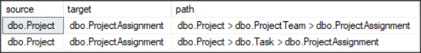
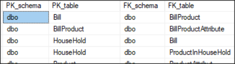

# Find circular references by SQL

This is a circular reference:


There are 2 paths from ProjectAssignment to Project, leading to potentially different results!

- ProjectAssignment -> Task -> Project
- ProjectAssignment -> ProjectTeam -> Project

In this project, "circular reference" means exactly that kind of situation: the same table can reach the same other
table through more than one chain of foreign-key relations.

## Quick steps

### For MS SQL server

1. Run the script [mssql/src/findCircularReferences.sql](src/findCircularReferences.sql)
1. You should get a list of circular references like this:
   

### Docker demo

For MS SQL Server:

1. Run the circular-reference demo:

```bash
docker compose -f mssql/docker-compose.yml run --rm demo-run
```

This starts SQL Server if needed, waits until it is ready, recreates `sql_circular_references`, loads the demo schema
from `mssql/test`, runs the analysis, and prints the result.

1. Clean up the demo containers:

```bash
docker compose -f mssql/docker-compose.yml down
```

The compose file uses `sa` with password `YourStrong!Passw0rd` by default. Override it with `MSSQL_SA_PASSWORD=...`
if you want a different password.

For PostgreSQL:

1. Run the circular-reference demo:

```bash
docker compose -f postgres/docker-compose.yml run --rm demo-run
```

This starts PostgreSQL if needed, waits until it is ready, recreates `sql_circular_references`, loads the demo schema
from `postgres/test`, runs the analysis, and prints the result.

1. Clean up the demo containers:

```bash
docker compose -f postgres/docker-compose.yml down
```

The compose file uses `postgres` / `postgres` by default. Override them with `POSTGRES_USER=...` and
`POSTGRES_PASSWORD=...` if you want different credentials.

The PostgreSQL demo does not publish host port `5432`; it runs only on the Compose network so it does not fight with an
existing local Postgres.

For MySQL:

1. Run the circular-reference demo:

```bash
docker compose -f mysql/docker-compose.yml run --rm demo-run
```

This starts MySQL if needed, waits until it is ready, recreates `sql_circular_references`, loads the demo schema from
`mysql/test`, runs the analysis, and prints the result.

1. Clean up the demo containers:

```bash
docker compose -f mysql/docker-compose.yml down
```

The compose file uses root with password `mysql` by default. Override it with `MYSQL_ROOT_PASSWORD=...` if you want a
different password.

For Oracle:

1. Run the circular-reference demo:

```bash
docker compose -f oracle/docker-compose.yml run --rm demo-run
```

This starts Oracle Database Free if needed, waits until it is ready, recreates the demo schema in user `CIRCREF`, loads
the demo schema from `oracle/test`, runs the analysis, and prints the result.

1. Clean up the demo containers:

```bash
docker compose -f oracle/docker-compose.yml down
```

The compose file uses `gvenzl/oracle-free:23-slim-faststart` and sets the `SYSTEM` password via `ORACLE_PASSWORD`,
defaulting to `oracle`. The demo objects are created in schema `CIRCREF`.

### Other RDBMS

1. Modify [Part 1](https://github.com/Wuodan/SQL-Find-Circular-References/wiki#part-1-list-all-pk-fk-relations) in the
   script. Write a query which lists all PK-FK relations in your DB.
1. Change the few SQL Server specific things like datatypes
1. Run your script
1. Send me a pull-request!!! :-)

## Further reading

- [Code explained](#code-explained): Step by step through the query
- [Circular references](#circular-references): What are they? Why does this work?
- [Test Data](#test-data): A sample database with circular references

## Circular references

This project looks for one specific kind of circular reference:

- one table can reach the same other table through more than one foreign-key path

That is the case shown in the example above:

- `ProjectAssignment -> Task -> Project`
- `ProjectAssignment -> ProjectTeam -> Project`

The scripts work on the schema only. They do not inspect row data. They show structures that deserve a closer look.

Here's another example:


## When this matters

Sometimes such a result is a warning sign.

Example:

- `InvoiceLine -> OrderLine -> Order`
- `InvoiceLine -> ShipmentLine -> Order`

If both paths are meant to describe the same business relation, then the schema may contain duplicated structure and can
lead to duplicate rows in queries. A second risk appears over time: one path may be maintained while the other is
forgotten, especially during cleanup or migration work, which can leave dead links or inconsistent data.

Sometimes such a result is perfectly fine.

Example:

```* `Order -> Person -> Country`

- `Order -> Organization -> Country`

This is common with shared lookup tables such as `Country`, `Currency`, `Language`, or `Status`. Both paths end in the
same table, but they describe different facts. In such cases the result is usually expected and does not mean that one
of the paths should be removed.

## Characteristics of circular references

What identifies such circular references?

- Primary key referenced more then once

One element of such circles is a table, whose primary key is referenced by more then one other table.

- Foreign key to more then one table

On the other side of the circle is a table with FK references to more then one table.

- Several chains of PK-FK relations between those 2 tables
  There is more then one path from the first to the second table.

## Code explained

So the question is: can we find such circular references by script?
Let's try ..

One note before looking at the SQL: the examples above are written the way people usually read them, from the
foreign-key table back to the referenced table. The implementation walks the same structure in the opposite direction,
starting at the referenced side and following which tables point to it.

## Code steps

1. List all PK-FK relations
1. Find PKs that are referenced more then once (reduces workload for next step)
1. Find all possible paths from those PK tables to any other table (using recursive CTE)
1. Identify problematic circles
1. Display result nicely as paths

### Part 1: List all PK-FK relations

Query all PK-FK relations to get a result like this:



and store it in a temp-table named #fk_pk.
(Filter out self-references with source = target table)

For SQL Server:

```sql
select      distinct
            PK.TABLE_SCHEMA PK_schema,
            PK.TABLE_NAME PK_table,
            FK.TABLE_SCHEMA FK_schema,
            FK.TABLE_NAME FK_table
from        INFORMATION_SCHEMA.TABLE_CONSTRAINTS PK
            inner join
            INFORMATION_SCHEMA.REFERENTIAL_CONSTRAINTS C
            on C.UNIQUE_CONSTRAINT_NAME = PK.CONSTRAINT_NAME
            inner join
            INFORMATION_SCHEMA.TABLE_CONSTRAINTS FK
            on C.CONSTRAINT_NAME = FK.CONSTRAINT_NAME
where       PK.CONSTRAINT_TYPE = 'PRIMARY KEY'
            and
            -- ignore self-references
            not (
                PK.TABLE_SCHEMA = FK.TABLE_SCHEMA
                and
                PK.TABLE_NAME = FK.TABLE_NAME
            )
```

### Part 2: Find PKs that are referenced more then once

Straightforward:

```sql
select      [columns]
from        #fk_pk fk_pk
where       exists(
                select      1
                from        #fk_pk fk_pk_exists
                where       fk_pk_exists.PK_schema = fk_pk.PK_schema
                            and
                            fk_pk_exists.PK_table = fk_pk.PK_table
                            and
                            not (
                                fk_pk_exists.FK_schema = fk_pk.FK_schema
                                and
                                fk_pk_exists.FK_table = fk_pk.FK_table
                            )
            )
```

### Part 3: Find all possible paths from those PK tables to any other table (using recursive CTE)

With part 2 as anchor a recursive CTE can track all paths leading away from the anchor tables.

```sql
with relation( [columns] ) as (
    /* Part 2: anchor tables */
    select      [columns]
    from        #fk_pk fk_pk
    where        exists(
                    select      1
                    from        #fk_pk fk_pk_exists
                    where       fk_pk_exists.PK_schema = fk_pk.PK_schema
                                and
                                fk_pk_exists.PK_table = fk_pk.PK_table
                                and
                                not (
                                    fk_pk_exists.FK_schema = fk_pk.FK_schema
                                    and
                                    fk_pk_exists.FK_table = fk_pk.FK_table
                                )
                )

    /* Part 3: Find all possible paths from those PK tables to any other table */
    union all

    -- recursive
    select      [columns]
    from        #fk_pk fk_pk_child
                inner join
                relation
                on  relation.FK_schema = fk_pk_child.PK_schema
                    and
                    relation.FK_table = fk_pk_child.PK_table
)
```

### Part 4: Identify problematic circles

From the relations in part 3, find start-end combinations that occur more then once.

```sql
select      [columns]
from        relation
where        exists(
                select      1
                from        relation relation_exists
                where       relation_exists.sourceSchema = relation.sourceSchema
                            and
                            relation_exists.sourceTable = relation.sourceTable
                            and
                            not (
                                relation_exists.PK_schema = relation.PK_schema
                                and
                                relation_exists.PK_table = relation.PK_table
                            )
                            and
                            relation_exists.FK_schema = relation.FK_schema
                            and
                            relation_exists.FK_table = relation.FK_table

            )
order by    [columns]
```

### Part 5: Display result nicely as paths

The recursive CTE is going through all those paths, so we can construct the paths easily in the select clauses there.
For Anchor:

```sql
select      [columns],
            PK_schema + '.' + PK_table + ' > ' + FK_schema + '.' +  FK_table path
```

For the recursion

```sql
select      [columns],
            relation.path + ' > ' + fk_pk_child.FK_schema + '.' + fk_pk_child.FK_table path
```

## Test Data

You can create test databases with some circular references using the scripts in:

- [mssql/test](test)
- [postgres/test](/home/stefan/development/github/Wuodan/SQL-Find-Circular-References/postgres/test)
- [mysql/test](/home/stefan/development/github/Wuodan/SQL-Find-Circular-References/mysql/test)
- [oracle/test](/home/stefan/development/github/Wuodan/SQL-Find-Circular-References/oracle/test)

That's it. Please let me know about bugs or your version!
